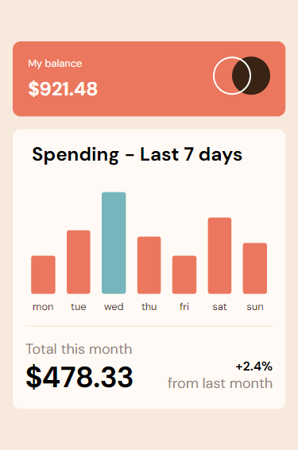
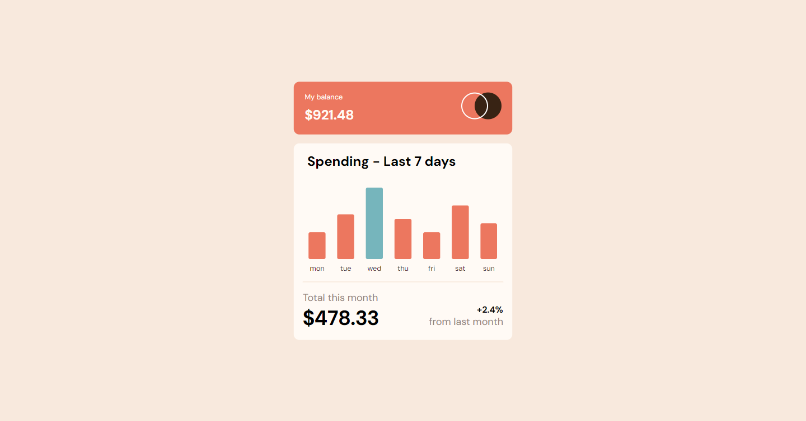
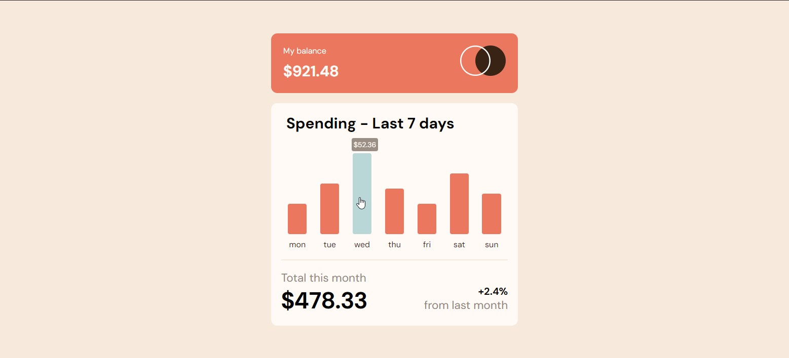

# Expenses chart component

This is a solution to the [Expenses chart component](https://www.frontendmentor.io/challenges/expenses-chart-component-e7yJBUdjwt).

## Table of contents

- [Overview](#overview)
  - [The challenge](#the-challenge)
  - [Screenshot](#screenshot)
- [My process](#my-process)
  - [Built with](#built-with)
  - [Useful resources](#useful-resources)
- [Author](#author)

## Overview

### The challenge

Users should be able to:

- View the bar chart and hover over the individual bars to see the correct amounts for each day
- See the current day’s bar highlighted in a different colour to the other bars
- View the optimal layout for the content depending on their device’s screen size
- See hover states for all interactive elements on the page
- **Bonus**: Use the JSON data file provided to dynamically size the bars on the chart

### Screenshot

- Mobile: 

- Destkop:

- Hover stats:

## My process

- Start by reviewing the user's instructions and understanding what was required.
- Create a new repository in Github.
- Create react app with vite  as the template engine using `npm create vite@latest my-react-app -- --template react-swc`
- Initialize git for version control.
- Set up the project structure using React and then change it to Components.
- Install and Add Sass in order to preprocess the css into a stylesheet.
- Import CSS files into each component.
- Create a responsive layout based on the provided design mock.
- Usually I use media queries since this is a simple project I've only added max-width to responsive containers.
- Add Animation to to the charts.
- Use `build` to bundle the project and `preview` in order to estimate if it needs anymore changes.
- I could've adjusted the JSON project for the bonus task, or just pass the values dynamically but it'd have made the design different from the mock up. 

### Built with

- Semantic HTML5 markup
- CSS custom properties
- Flexbox
- Mobile-first workflow
- [React](https://reactjs.org/) - JS library
- Sass
- Vite

### Useful resources

- [Sass](https://sass-lang.com/) - Sass is the most mature, stable, and powerful professional grade CSS extension language in the world.
- [Vite](https://vitejs.dev/) - Vite is a build tool that aims to provide a faster and leaner development experience for modern web projects. It consists of two major parts: dev server and a build command.

## Author

- Github - [Github](https://github.com/amrmabdelazeem)
- Frontend Mentor - [@amrmabdelazeem](https://www.frontendmentor.io/profile/amrmabdelazeem)